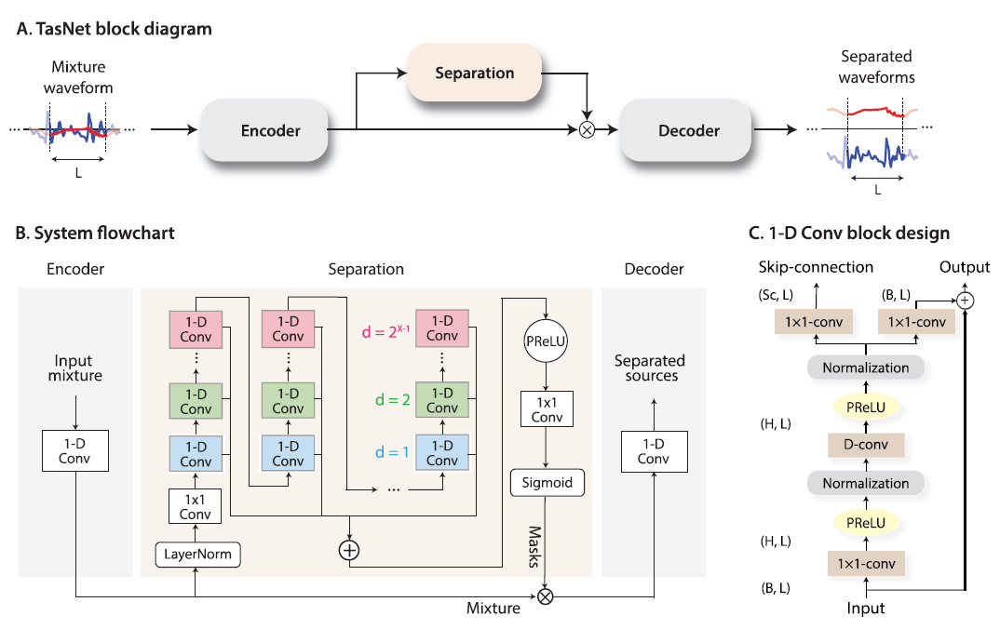
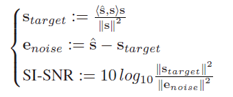
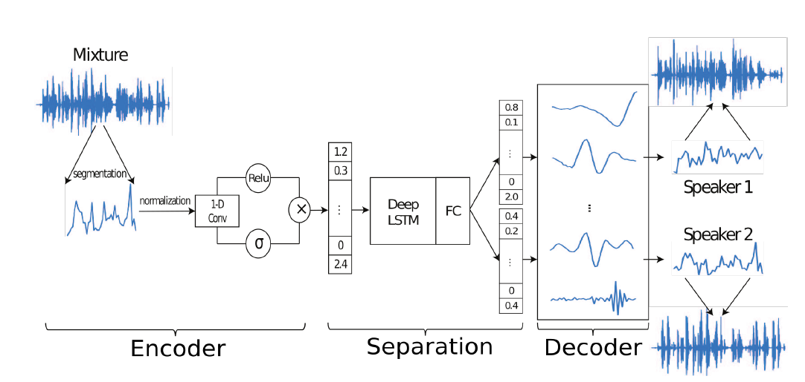

# 精读: 
## Conv-TasNet: Surpassing Ideal Time-Frequency Magnitude Masking for Speech Separation
### Summary
This paper proposes a fully convolutional time-domain audio separation network, a deep learning framework for end-to-end time domain speech separation. The proposed network consists of encoder, separator, and decoder. This method avoids the shortcoming of separation methods using time-frequency representation of the mixed signal. The results indicate that Conv-TakNet surpasses several ideal time-frequency magnitude masks in two-speaker speech representation.
- 直接在**时域**上做信号分离,可以避免将声音的大小声和相位做分离,规避时频谱方法的缺陷.
- Conv-Tasnet可分为三个区块，编码器（encoder）、分离器（separator）和解码器（decoder），编码器将一小段的混和信号换转换为在特征空间（feature space）上的特征向量，借由这个特征向量，分离器要找出一个相对应的**遮罩（mask）**，将特征向量和遮罩做相乘后，再用解码器将其转换为原始讯号源所发出的单一信号。
### Basic idea
Compared with previous work TasNet, th proposed convolutional TasNet uses only convolutional layers in all stages of precessing. Motivated by the success of temporal convolutional network (TCN) models, Conv-TasNet uses stacked dialated 1-D convolutional blocks to replace the deep LSTM networks for the separation step. The use of convolution allows parallel processing on consecutive frames or segments to greatly speed up the separation process and also significantly reduces the model size.

### System components
- Encoder: generates a representation fo the audio waveform optimized for separating individual speakers.
- Separator: stands as a mask to apply a set of weighting functions to the representation of encoder to separate the audio waveform 
- Decoder: invert the encoder representation into the waveforms using a linear method.

- Training objective
  - scale-invriant source0-to-noise ratio (SI-SNR)

- Metrics
  - SI-SNRi (dB): scale-invariant singal-to-noise ratio improvement
  - SDRi (dB): signal-to-distortion ratio improvement
# 泛读
## Deep clustering: Discriminative embeddings for segmentation and separation
### Summary
This paper address the problem of acoustic source separation in a deep learning framewrok which is called "deep clustering". 即将**时频谱**的抽样时刻和频率,利用神经网络和集群来分成不同群,每一群中的抽样所占比例最大的那个类即为讲话者。
### Shortcoming (利用时频谱来作为信号的特征的缺点)
- **是否是最佳表示:** 短时距傅立叶变换是一个通用的讯号转换，然而在讯号分离的任务上，未必是最佳的讯号特征。
- **相位重建误差:** 在反短时距傅立叶变换时，需要重建原始讯号的相位（phase），即使可以分离出跟原始信号一样的时频谱，然而具有偏差的估计会影响到重建讯号的准确度。
- **实时性差:** 利用时频谱来做讯号分离是需要混和讯号高分辨率的频率分解，要用横跨较长时间的窗函数来做短时距傅立叶变换，这个会增加系统的延迟，不利于即时的语音处理任务，像是在电信设备中的应用。
## TasNet: Time-domain Audio Separation network for real-time singal-channel speech separtion
### Summary
This paper proposes a Time-domain Audio Separation Network (TasNet) to overcome the limitions of time-frequency based separation methods. The proposed network models the signal in the time0-domain directly using an encoder-decoder framework and perform the source separation on nonnegtive encoder outputs.
### Basic idea
Most methods attempt to construct a mask for each source in time-frequency representation of the mixture signal. The authors think this is not necessarily an optimal representation for speech separation. In addition, time-frequency decomposition results in inherent problems such as phase/magnitude decoupling and long time window which is required to achieve sufficient frequency resolution.
### System components
