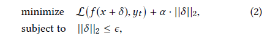
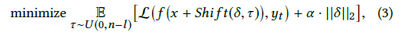

# 精读
## AdvPulse: Universal, Synchronization-free, and Targeted Audio Adversarial Attacks via Subsecond Perturbations
### Summary
The author propose a method to generate subsecond-level audio perturbations to alter the recognition results of the ASR system. The proposed method do not need prior knowledge about the targets audio and can operate in a synchronization manner. 
### Challenge
- No prior knowledge about what the victim says
- Asychronization between the adversarial perturbation and the speech

### Novelty
- Most existing attacks need to apply the perturbation to the audio within the whole duration.
- The proposed attack method do not need prior knowledge about the target, which makes it significantly different from existing over-the-air audio adversarial attacks.
- It can works in a asynchronization manner. But Most existing attacks are absed on the assumption that the input audio and the generated adversarial perturbation are strictly synchronized.
- Black-box attack?
### Attack scenarios
- Static-speech attack: the audio input is mixed with the adversarial perturbation and played by the adversary.
- Streaming-speech attack (Over-th-air): the adversary injects the adversarial perturbation by a loudspeaker while the ASR interacting with a real person.

- Target models: X-vector system (state-of-the-art text-independent DNN-based model)
 ### Basic idea
- Synchronization-free
  - Commonly, the feature-map of speaker recognition is derived by segmenting raw data into several segmented frames and then concateing them together into a feature-map. Thus, it is possible to fool the model by introducing a short perturbation into part of the features before the feature aggregation.
  1. Feasibility 
   - Thus, we can solve the following optimal adversarial problem to generate the perturbations:
    
  2. Subsecond perturbation generation
    - optimal problem with time delay:
        

        The author sample random time delays with a step size of 1 digit sample.
- Universal (targeted)
  - a set of training data samples sampled from the distribution u. Iterate through each data sample to update the adversarial perturbation by applying gradients.
- Practical Over-the-Air Attack
  - Using band-pass filter to cope with speaker&microphone limitations. (adding band-pass constraints into the optimization equation)
  - Absorption and Reverberation (affected by the envionment layouts): using a group of RIRs (Room Impulse Response) collected in various environments to improve the robustness of the generated adversarial perturbation.
### limitation
- White-box attack (prior knowledge about the model, Loss function, and datasets which was not mentioned in the paper)
- The tested model is trained by the authors themselves. So it is doubt that the attack works well on other commercial models in real scenarios.
- The Over-the-Air attack is targeted on a loudspeaker which playing streaming speech (victim's utterances or speech commands) rather than a real person.

# 泛读
## TEMPEST Comeback: A Realistic Audio Eavesdropping Threat on Mixed-signal SoCs
### Summary
This paper unveils a new audio eavesdropping attack through the EM radiations on MSoCs (mixed-signal system on chip). The proposed eavesdropping method leverages the coupling between the audio singal and the system clock. The experimental results indicate that the attack has a higher attack availability and lower attack difficulty.
### Basic idea
The trends of SoC evoluation and integration of SWREG makes the TEMPEST threat possible. The SWREG has innate strong and low-frequency switching noises and an audio signal is conductively coupled on the single common substrate of the MSoC with a system
clock and the newly emerging switching noises; the coupled
audio signals on the substrate are emitted externally. So the strong noise characteristics of SWREG make it possible for an attacker to performa a audio TEMPEST (attack) on the MSoC.

## When the Differences in Frequency Domain are Compensated: Understanding and Defeating Modulated Replay Attacks on Automatic Speech Recognition
### Summary
The authors uncover a new type of replay attack called modulated replay attack, which can bypass the existing frequency domain based defense systems. The basic idea is to compensate
for the frequency distortion of a given electronic speaker using an inverse filter that is customized to the speaker’s transform characteristics. The experiments on real smart devices confirm the modulated replay attacks can successfully escape the existing detection
mechanisms that rely on identifying suspicious features in the frequency domain. The authors also propose a countermeasure named DualGuard to defend against the attack.
### Basic idea
Attack: By evaluating thge transfer characteristics of electronic speakers, an attacker can customize a pre-processing filter for any given speaker to imate a real speaking person and fraud the ASR.

Defense: it is inevitable for any replay attacks to either leave ringing artifacts in the time domain or cause spectrum distortion in the frequency domain.